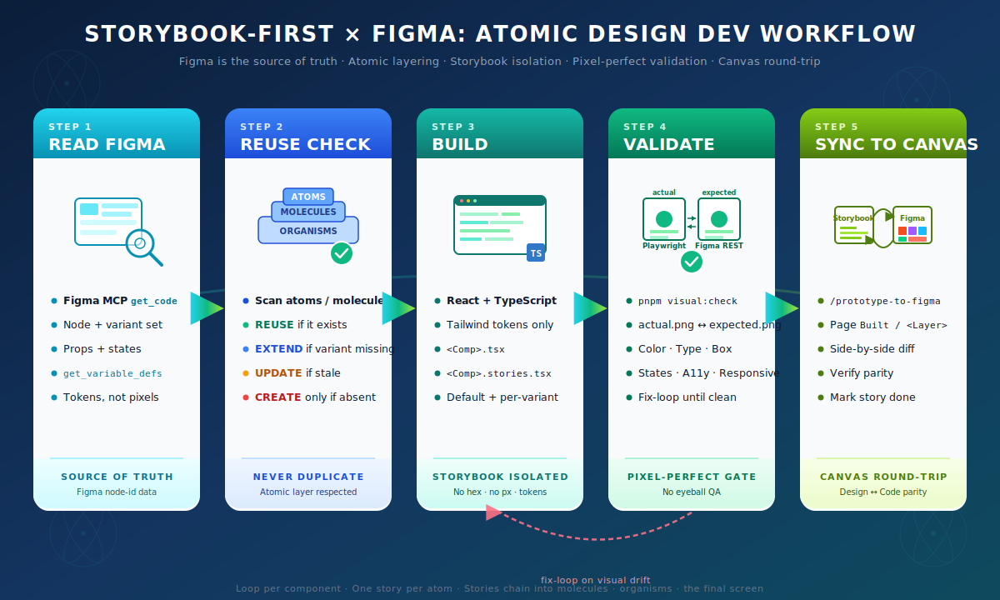

# Storybook-First with Figma

### A bidirectional workflow for pixel-perfect atomic design



---

## The problem we kept hitting

Two failure modes dominate the UI side of any non-trivial product.

The first is **visual approximation**. A button ends up with a hex that is *close enough* to the design. Spacing snaps to Tailwind's default scale instead of the exact Figma value. The font looks right but renders as Inter where Barlow Semi Condensed was specified. None of these are bugs anyone would catch in a code review — they only surface when a stakeholder opens the page next to the Figma file and notices that nothing quite matches.

The second is **silent duplication**. Every developer builds *their own* button, *their own* badge, *their own* way of truncating text. The design system slowly becomes a catalog of near-variants that never get consolidated. Six months in, the project has three `<Button>` components and four different definitions of "primary blue."

The combination compounds: visual drift makes reuse harder (the existing component no longer looks right, so people copy it and "fix" it locally), and reuse erosion guarantees more visual drift (each copy diverges further).

**Storybook-First with Figma** is the workflow we built to break that loop. It runs end-to-end inside a BMad-driven dev agent, gated by an automated visual diff that can't be eyeballed away.

---

## What "Storybook-First" means

The principle is simple: **a component never enters a page until it is finished, validated, and documented in Storybook.**

Concretely: when the dev agent picks up a story whose Acceptance Criteria reference a Figma node, it does not jump to the page that will consume the component. It builds the component in isolation — code, types, variants, states, accessibility — alongside a `.stories.tsx` file that documents every variant. Only after Storybook proves that the piece is correct does the page integration happen.

The trick that makes Storybook-First actually work, rather than feeling like overhead, is **strict adherence to Atomic Design**. Atoms are leaves that import nothing UI. Molecules compose atoms. Organisms compose molecules. Pages compose organisms. The cost of one Storybook entry per atom is paid back twenty times by every layer above it that simply *uses* the entry.

---

## The five-step loop

Every UI story — every single one — follows the same five-step loop, illustrated above. The dev agent loads it as foundational context on activation and is bound to it for the run.

### 1. READ FIGMA

The first call the dev agent makes is to the **Figma MCP server**, not to a text editor. It pulls the node referenced in the story (`get_code`), enumerates its variant set, and resolves its bound variables (`get_variable_defs`). Tokens come back named — `color/burst-action-primary`, not `#00C0F3` — preserving the connection between the raw value and the design system's intent.

This step exists because the alternative — eyeballing the Figma file in another tab — is exactly what produces visual approximation. The agent doesn't infer; it queries.

### 2. REUSE CHECK

Before the agent writes a single line of code, it scans `src/components/atoms/`, `molecules/`, and `organisms/` for an existing match. Each candidate falls into one of four buckets:

- **REUSE** — exists and matches Figma. Import it. End of story.
- **EXTEND** — exists but is missing a variant the new story needs. Add the variant to the existing component, do not fork.
- **UPDATE** — exists but conflicts with Figma because the design moved. The agent HALTs and asks: update to match the new design, or keep the current version because it's right for an earlier consumer? This is a decision a human must make.
- **CREATE** — actually new. Build it.

The hard rule that governs this step: **if an atomic version of the component already exists, that is the only correct implementation.** A raw `<button>` with hand-rolled classes when an `<AppButton variant="...">` exists is always wrong.

### 3. BUILD

For everything classified as CREATE or EXTEND, the agent builds the encapsulated folder:

```
<ComponentName>/
├── ComponentName.tsx           ← structure and logic
├── ComponentName.stories.tsx   ← Default + one story per variant/state
└── index.ts                    ← barrel export
```

Three rules apply without exception:

- **Tokens, never hardcoded values.** Every color, spacing value, radius, and shadow consumes a token defined in `src/tokens/tokens.ts`, surfaced through Tailwind's theme. A literal `bg-[#003847]` is a defect.
- **One story per Figma variant.** If Figma documents `Primary`, `Secondary`, `Disabled`, `WithIcon`, all four must appear as Storybook stories — not as a single story with knobs to flip.
- **Atoms are leaves.** An atom that imports another atom is, by definition, a molecule. The agent enforces this; the layer boundary is non-negotiable.

### 4. VALIDATE

Here is where pixel-perfect stops being a slogan.

The agent runs `pnpm visual:check` against the component's Storybook story. This produces two PNGs, both at 2x device pixel ratio:

- **`actual.png`** — Playwright captures the Storybook story canvas in headless Chromium.
- **`expected.png`** — A Figma REST API call (`/v1/images/<file>?ids=<node>&scale=2&format=png`) renders the source node directly. No screenshot of a Figma tab; the Figma renderer itself produces the file.

The agent then **reads both PNGs** (the model is multimodal) and walks a fixed checklist: backgrounds, text colors, icon colors, border colors, gradient stops with angles, font families and weights and line-heights and letter-spacing, padding per side, gaps, radii per corner, shadows per layer, opacity, every state (hover, active, focus, disabled, loading), cursor affordance, truncation behavior, and responsive breakpoints.

Every failing item enters a fix loop: identify the property → look up the exact value in Figma via MCP → adjust the Tailwind class or extend the token set → re-render → re-screenshot → re-walk the checklist. The component is not marked done until the checklist is clean.

When `actual.png` and `expected.png` disagree, the **Figma values** are the source of truth — never the PNGs. Measuring pixels off an image by eye is exactly the failure mode we are eliminating.

### 5. SYNC TO CANVAS

The last step closes the loop. Once the component passes validation, the agent invokes `/prototype-to-figma` (a Figma MCP skill) and pushes the built component back to a page named `Built / Atoms` (or `/ Molecules`, `/ Organisms`, `/ Screen`) in the same Figma file. The original design frames stay pristine; the round-tripped versions land on a parallel canvas where designers can scroll between them and verify parity.

This step is *adopted* from Figma's [Code to canvas](https://help.figma.com/hc/en-us/articles/40219873508247-Workflow-lab-Code-to-canvas) workflow — credit where due. Steps 1–4 are our addition that makes the round-trip bidirectional.

---

## How the Figma MCP fits in (and what we chose not to use)

The Figma names sprinkled through the five steps — `get_code`, `get_variable_defs`, `/prototype-to-figma` — are not things we implemented. They are **exposed by the Figma MCP server itself**, the moment a project's `.mcp.json` points at `https://mcp.figma.com/mcp` and a user runs `/mcp` in Claude Code to authenticate. Two kinds of capability arrive in that single OAuth handshake:

- **MCP tools** — function calls in the agent's tool catalog (`get_code`, `get_variable_defs`, `get_image`). The agent uses these the way it uses Read or Bash: programmatically, inside a single step.
- **MCP skills** — slash commands invoked by name (`/prototype-to-figma`, `/figma-generate-design`, `/figma-generate-library`, `/figma-use`). Think of them as multi-step recipes the Figma team packaged.

So the question is not "did we build these?" — we did not — but **"which ones did we choose to orchestrate, and where?"** The answer is in the table below.

| MCP capability | Type | Used in our loop | Notes |
|---|---|---|---|
| `get_code` | tool | **Step 1 (Read)** | Mandatory first call on every UI story |
| `get_variable_defs` | tool | **Steps 1 + 4** | Read at start, again to resolve drift during Validate |
| `get_image` | tool | *replaced* | We bypass MCP here — see below |
| `/prototype-to-figma` | skill | **Step 5 (Sync)** | Hardcoded as a task in every story file |
| `/figma-generate-design` | skill | — | Code-first → canvas; we have a design already |
| `/figma-generate-library` | skill | — | Designer-driven variable authoring; not our case |
| `/figma-use` | skill | — | Canvas-native ideation; orthogonal to dev work |

Three of the four Figma-provided skills sit on the table but never enter our loop. They are listed in the manual as "available, fyi" — they belong to designer-driven workflows the team can run separately. Only `/prototype-to-figma` is mandatory, because it is what closes the round-trip.

The one place we **deliberately bypass the MCP** is the `expected.png` half of `visual:check`. Instead of calling the MCP `get_image` tool, the script hits the Figma REST API directly (`/v1/images/<file>?ids=<node>&scale=2&format=png`). Three reasons:

1. **Determinism** — REST returns the same PNG every time; MCP responses can be shaped by session state.
2. **CI-friendly** — REST runs anywhere with a `FIGMA_TOKEN`; the MCP path needs Claude Code plus interactive OAuth.
3. **Reproducibility** — the `actual.png` ↔ `expected.png` pair committed to no-one's repo (it is `.gitignore`d) but produced identically on every dev's laptop and in CI.

The takeaway: **the MCP provides the execution; the BMad customization layer provides the policy.** Our `bmad-dev-story.toml` is the file that says "you MUST use this tool here," "you MUST invoke this skill there," "you do NOT touch these three skills." Without it, the same MCP would be available but the agent would have no reason to prefer one capability over another.

---

## What your Figma file needs to have

The five-step loop reads from Figma, then writes back to Figma. Both halves only work if the Figma file is structured for the workflow. The dev agent fishes for what's there — but it can only catch what the file actually contains.

**Minimum viable Figma:**

- **Variables** for colors, spacing, radii, typography. These come back from the MCP as named tokens (`color/burst-action-primary`, not `#00C0F3`) and become the entries in `src/tokens/tokens.ts`. Without them, the agent derives tokens from inline fills and has to invent names from raw values.
- **Atomic-design frames** — the file is organized into frames named (or grouped under) Atoms, Molecules, Organisms, and a target Screen. The sprint stories reference specific node-ids per layer; missing layers cause the discovery story to HALT.
- **Components with variants** — each reusable piece is a proper Figma Component with a complete variant set covering states (default/hover/disabled) and configurations (size, intent). The agent maps Figma variants to React props 1:1. Detached instances or raw shapes still render, but lose the prop matrix.

**What happens in degraded Figmas:**

| Figma state | Result |
|---|---|
| No published Variables, no Styles | Tokens get derived from inline values; you'll review and rename the generated set before continuing |
| No atomic frames, single screen mockup | Discovery story HALTs; the design has to be broken into layers by hand first |
| Detached instances instead of Components | Each occurrence becomes its own one-off; reuse breaks at the molecule level |
| Rasterized fills (PNG, image overrides) | Agent reads the image but can't extract structure — treat these as black boxes |

**Rule of thumb:** if a designer can scroll the file and immediately point at "this is the Button atom, here are its five variants, and these are the colors it uses," the workflow flies. If figuring out what's reusable takes five minutes of design exploration, the dev agent will spend that time too — and you'll get a cleaner result by tidying the Figma file before starting the sprint than by hoping the agent tidies it for you.

The visual-check step turns out to be a useful sanity test for design quality, too. If `actual.png` and `expected.png` disagree everywhere on the first run, that's usually a sign that the Figma file has more raw values than tokens; the fix is in Figma, not in the code.

---

## Why it holds up

Three properties make this workflow survive contact with a real team.

**The visual values of the design become structured data before code exists.** The dev agent doesn't infer, doesn't sample the rendered PNG, doesn't fall back to framework defaults. Every hex, every px, every token comes from a JSON file that came straight from the Figma API.

**Reuse is enforced by an explicit gate.** The inventory step isn't a suggestion — the agent cannot move from classification to implementation without answering, for each component, whether something already exists. The `bmad-dev-story` customization loads this as a persistent fact at activation; it cannot be skipped without a HALT.

**Components live in isolation before becoming part of a page.** That breaks the cycle of "I tweak it on the PDP, discover it broke on the cart, fix it there, discover it now drifts from the design system." The piece is born right, validated, documented — and the page simply consumes it.

The cost is a fixed sequence that can feel heavy on small stories. Building a Storybook entry for a four-variant badge can sound like overkill the first time. But the catalog grows: on the next badge, the next molecule, the next feature, the upfront work of classification and inventory pays for itself: REUSE replaces CREATE, and the whole story becomes "compose existing components" rather than "build from scratch for the fifth time."

---

## How BMad orchestrates the loop

The workflow runs *on top of* BMad's standard sprint orchestration. We did not fork anything; everything lives in two well-defined extension points:

- **`_bmad/custom/bmad-dev-story.toml`** — adds a handful of `persistent_facts` to the dev agent's activation, anchoring every run in the workflow manual.
- **`_bmad-output/implementation-artifacts/`** — the standard sprint folder, populated with five base stories (`1-1-bootstrap-and-tokens` through `1-5-screen`) plus a discovery story that generates per-atom stories from Figma at runtime.

The dev agent, the sprint-status driver, the story file format, the validation skill — all stock BMad. We added the *UI-development discipline*; BMad provided the *flow control*.

---

## Adopting it: install the module

Everything described above lives in this repository. The `install.sh` at the root drops 15 files into a target project and parameterizes them with your Figma file's keys.

### Prerequisites

| Tool | Minimum | Notes |
|---|---|---|
| BMad | core + `bmm` module | Provides `bmad-dev-story` |
| Claude Code | latest | MCP client for Figma |
| Node | 20+ | For `visual-check.mjs` |
| pnpm | 9+ | npm works too |
| Figma | account + file + personal token | Token needed for the REST image export |

Replace the `<FIGMA_FILE_KEY>` and `<NODE_ID>` placeholders with your project's values.

### Install

**One-liner, with values:**

```bash
REPO=https://github.com/keith-sarate/story-book-first-with-figma.git
git clone --depth 1 "$REPO" /tmp/sb-figma
/tmp/sb-figma/install.sh /path/to/your/project \
  --file-key  <FIGMA_FILE_KEY> \
  --file-name <figma-file-slug> \
  --atoms     <NODE_ID> \
  --molecules <NODE_ID> \
  --organisms <NODE_ID> \
  --screen    <NODE_ID>
```

**Interactive (recommended for the first run):**

```bash
REPO=https://github.com/keith-sarate/story-book-first-with-figma.git
git clone --depth 1 "$REPO" /tmp/sb-figma
/tmp/sb-figma/install.sh /path/to/your/project
```

The installer prompts for every value, shows a summary, asks for confirmation, then writes the files and prints next steps.

**As a git submodule (recommended for teams):**

```bash
REPO=https://github.com/keith-sarate/story-book-first-with-figma.git
cd /path/to/your/project
git submodule add "$REPO" vendor/sb-figma
vendor/sb-figma/install.sh .
```

### What lands in the target

```
target/
├── .mcp.json                                       # Figma MCP server
├── .env.example                                    # FIGMA_TOKEN, FIGMA_FILE_KEY
├── .gitignore                                      # appended with .env, _visual-checks/, etc.
├── docs/workflows/
│   ├── storybook-first-with-figma.md               # the operating manual
│   └── storybook-first-with-figma.svg              # the diagram on the cover of this article
├── scripts/visual-check.mjs                        # Playwright + Figma REST
├── _bmad/custom/bmad-dev-story.toml                # persistent_facts injection
└── _bmad-output/implementation-artifacts/
    ├── README.md
    ├── sprint-status.yaml
    ├── 1-1-bootstrap-and-tokens.md                 # Vite + Tailwind + Storybook + tokens
    ├── 1-2-0-atoms-discovery.md                    # generates per-atom stories
    ├── _atom-story-template.md                     # stamped out per atom
    ├── 1-3-molecules.md
    ├── 1-4-organisms.md
    └── 1-5-screen.md
```

The installer never touches BMad core or module files. It only writes to `_bmad/custom/`, `_bmad-output/`, and project-level paths.

### After install — five things to do

1. **In Claude Code**, run `/mcp` and approve the `figma` server.
2. `cp .env.example .env` and paste your Figma personal access token (mint one at [figma.com/settings](https://www.figma.com/settings)).
3. Install Playwright if your project doesn't have it:
   ```bash
   pnpm i -D playwright @playwright/test dotenv
   pnpm exec playwright install chromium
   ```
4. Add to `package.json`:
   ```json
   "scripts": { "visual:check": "node scripts/visual-check.mjs" }
   ```
5. Open Claude Code and say:
   ```
   > dev the next story
   ```

   That picks up `1-1-bootstrap-and-tokens.md`, sets up Vite + React + Tailwind + Storybook 8, extracts your design tokens from Figma, and verifies the visual-check pipeline end-to-end before yielding back.

From there, every subsequent `dev the next story` builds one atom, one molecule, one organism — each isolated in Storybook, each validated against Figma, each pushed back to canvas. The final story composes the organisms into the target screen, and the demo is done.

---

## Installer flags reference

| Flag | Effect |
|---|---|
| `--file-key KEY` | Figma file key (the path segment after `/design/`) |
| `--file-name NAME` | Slug after the file key in URLs (display only) |
| `--atoms ID` | Atoms frame node-id, `N:NNN` form (e.g. `4:581`) |
| `--molecules ID` | Molecules frame node-id |
| `--organisms ID` | Organisms frame node-id |
| `--screen ID` | Full-screen frame node-id |
| `-y, --yes` | Non-interactive — fail on missing values rather than prompt |
| `-n, --dry-run` | Show what would happen, write nothing |
| `-f, --force` | Overwrite existing files (default: skip with warning) |
| `-h, --help` | Print full usage |

---

## A closing note on cost

This workflow has a fixed setup cost — about ninety minutes for a fresh project, most of which is consumed by Story 1.1 (the dev agent automates it but you watch). After that, the marginal cost per component is roughly five to ten minutes for a typical atom and proportionally more for molecules and organisms that compose them.

The benefit is harder to measure but easier to feel: when you open the final screen next to its Figma frame on a stakeholder call and the answer to "does this match the design?" is "yes, here is the side-by-side proof" — that's worth the ninety minutes, and the next project the cost is gone because the module ports in a single shell command.

---

**References**

- The Dev Operating Manual: [`templates/docs/workflows/storybook-first-with-figma.md`](../templates/docs/workflows/storybook-first-with-figma.md) — the canonical, agent-loaded version of the workflow. The installer drops it into every target project.
- The adoption playbook (reference-style, less narrative): [`docs/adoption-guide.md`](../docs/adoption-guide.md).
- The installable module lives at the root of this repository — see [`README.md`](../README.md) for the full install matrix.
- Inspired by Figma's [Workflow lab: Code to canvas](https://help.figma.com/hc/en-us/articles/40219873508247-Workflow-lab-Code-to-canvas) (Step 5 of our flow).
